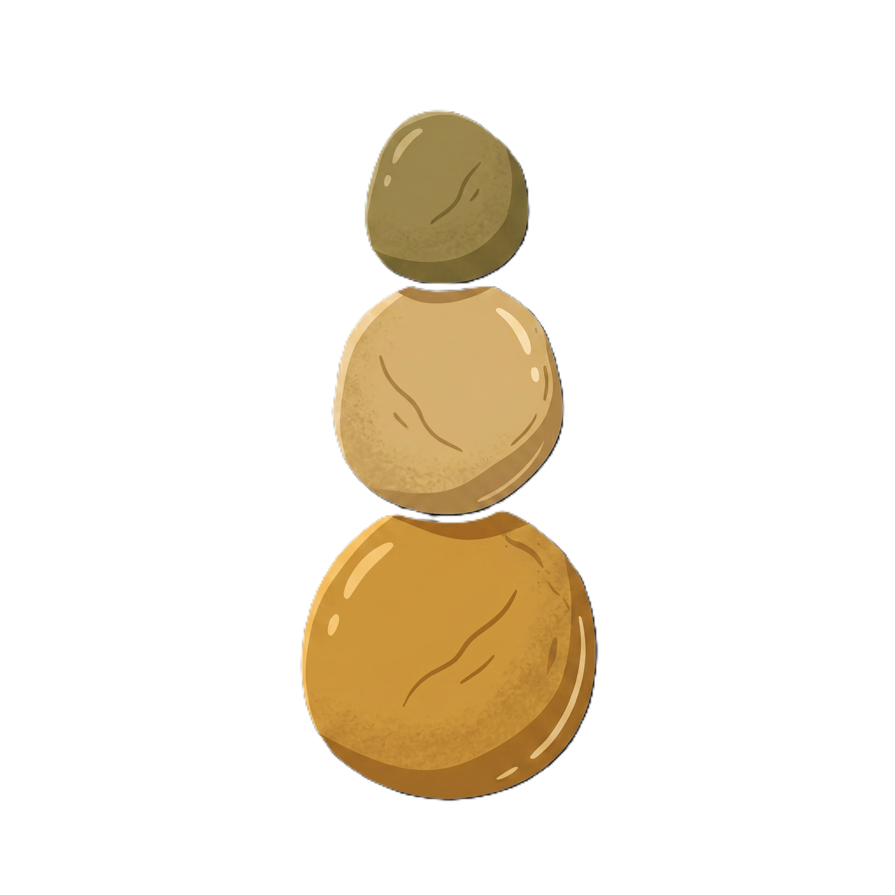
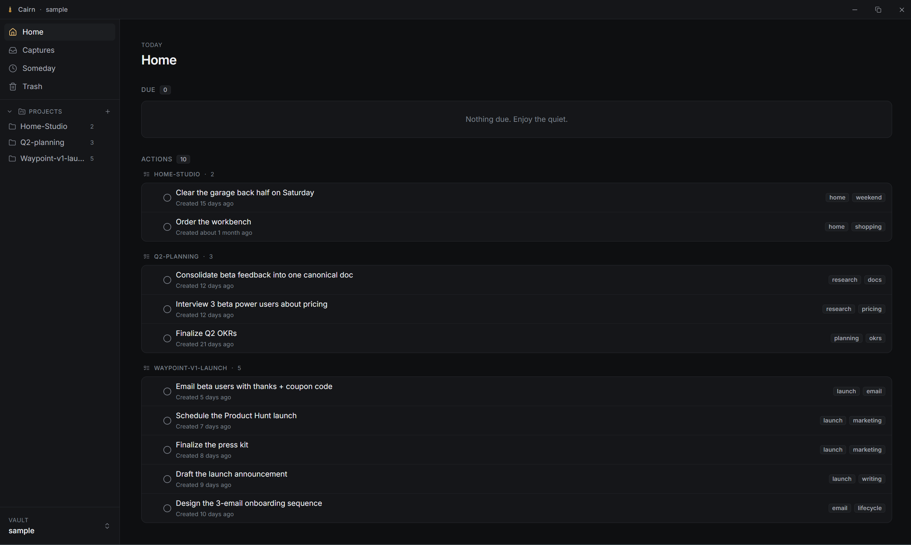
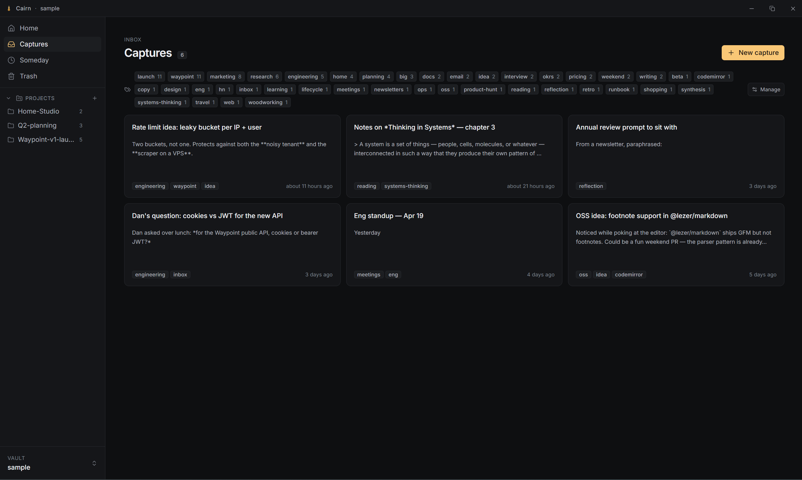
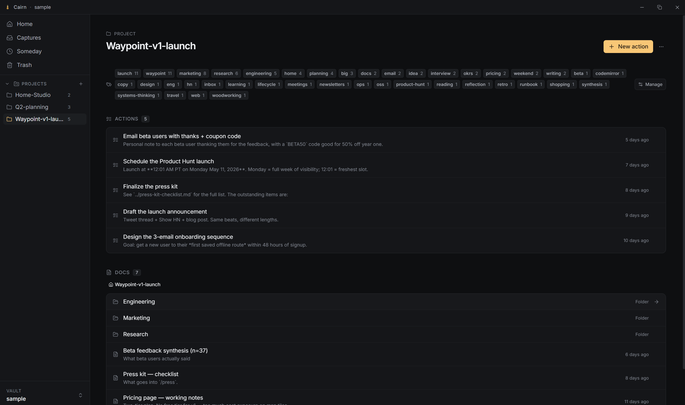
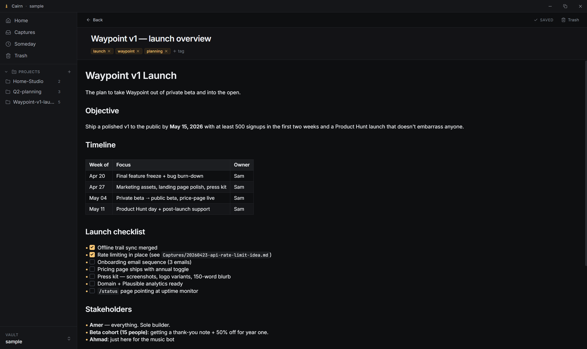

<p align="center">
  
</p>

<p align="center">
  <em>Una aplicación de notas y GTD local-first para quienes se toman el pensamiento en serio.</em>
</p>

---

> Creé Cairn para cubrir un vacío que tenía en mi configuración de Obsidian y que simplemente no podía lograr con complementos, por muy esforzado que me pusiera. Quería una forma ordenada de capturar mis ideas al vuelo mientras trabajaba, pasarlas revista > y ampliarlas de manera sencilla, y finalmente organizar mi conocimiento en todos los proyectos de una forma amigable para LLM. A principios de este año, leí una copia de *Getting Things Done* de David Allen, adopté algunos de sus principios y les di un giro que se adapta a mi flujo. Esta nueva estructura aumentó drásticamente mi productividad hacia la segunda mitad de 2025, y Cairn implementa ese sistema de forma nativa. Ya lo uso a diario, y si ayuda a una sola persona a acercarse un paso más a sus metas, habrá cumplido su propósito.

## Vélo en acción

El flujo de captura rápida. Un atajo global, un diálogo flotante, una nota en disco.

<div align="center">
  <div>
    <a href="https://www.loom.com/share/764378b747914153a76edf5e057592bf">
      
    </a>
  </div>
</div>

## Qué es Cairn

Cairn es una aplicación de escritorio para capturar, organizar y actuar sobre tus ideas. Toma la disciplina de markdown primero de Obsidian y la metodología *Getting Things Done* de David Allen, y las aplica a una única promesa: tu conocimiento se queda contigo.

Cada nota es un archivo `.md` simple en una carpeta que tú eliges. Un pequeño directorio `.cairn/` dentro de cada bóveda almacena la configuración, el estado, el índice de recordatorios y las notas eliminadas suavemente. Todo lo demás es tu markdown, legible por cualquier editor, compatible con copias de seguridad y preparado para el futuro.

No hay nube, no hay sincronización, no hay telemetría, no hay cuentas.

## Un recorrido rápido

### Inicio

Tu día de un vistazo. Acciones abiertas en todos los proyectos, ordenadas como las hayas arrastrado. Recordatorios pendientes para hoy. Actividad reciente para que puedas retomar donde lo dejaste.

<p align="center">
  
</p>

### Capturas

La bandeja de entrada. Pensamientos rápidos, notas de reuniones, ideas a medio formar. Procésalas después, muévelas a un proyecto cuando su estructura esté clara o envíalas a Alguna vez si no están listas.

<p align="center">
  
</p>

### Proyectos

Un proyecto es una carpeta. Las notas sueltas viven en la raíz, las tareas de acción de GTD están bajo `Actions/`, y puedes anidar subcarpetas tan profundamente como quieras. La ruta de navegación te sigue.

<p align="center">
  
</p>

### El editor

CodeMirror 6 con una pipeline completa de vista previa en vivo. GitHub Flavored Markdown completo: las tablas se renderizan como HTML real, las casillas de listas de tareas son clickeables, las imágenes se cargan en línea, `~~tachado~~` hace lo que dice. Los marcadores de sintaxis se ocultan cuando el cursor no está sobre ellos, manteniendo el código fuente markdown limpio.

<p align="center">
  
</p>

## Características de un vistazo

- **Capturas.** Una bandeja de entrada para tirar cualquier cosa: pensamientos rápidos, memorandos y pegamentos.
- **Proyectos y Acciones.** Carpetas de proyecto para conocimiento, carpetas `Actions/` para trabajo GTD. Las acciones completadas se archivan junto al archivo con una nota de reflexión opcional.
- **Alguna vez (Someday).** Ideas estacionadas con recordatorios predeterminados (mañana, en una semana, en un mes) que se activan mediante notificaciones del SO y avisos dentro de la aplicación.
- **Editor de vista previa en vivo.** Encabezados, negrita, cursiva, código en línea, tachado, enlaces, imágenes, listas de tareas y tablas GFM se renderizan mientras escribes. El código fuente markdown permanece intacto.
- **Pegar imágenes.** Arrastra una imagen a una nota y Cairn la guarda en el directorio `assets/` más cercano e inserta un enlace relativo.
- **Etiquetas.** Aplica mediante frontmatter o la barra de metadatos. Renombra o cambia el color en toda la bóveda con una sola acción. Las claves de frontmatter desconocidas se conservan textualmente.
- **Paleta de comandos.** `Ctrl/Cmd + K` para navegar y realizar búsquedas de texto completo en toda la bóveda.
- **Captura Rápida.** Un atajo de teclado a nivel de sistema abre una pequeña ventana flotante para capturar sin salir de lo que estés haciendo.
- **Papelera con restauración.** Eliminación suave en `.cairn/trash/` manteniendo la ruta espejada. Un clic para restaurar, con renombrado en caso de colisión si es necesario. Vaciar Papelera elimina permanentemente.
- **Multibóveda.** Registra varias bóvedas y cambia entre ellas desde la barra lateral.
- **Consciente de cambios de archivos.** Las ediciones realizadas por herramientas externas (otro editor, `git pull`) se reflejan en la interfaz dentro de una ventana de debounce.

## Principios de diseño

- **Local primero.** Nada sale de tu máquina.
- **Markdown puro.** Tus archivos son legibles por cualquier editor. Cairn es una lente sobre ellos, no un contenedor.
- **El frontmatter desconocido es sagrado.** Las claves YAML escritas a mano sobreviven a cada ciclo. Cairn solo toca los campos que entiende.
- **Enfoque tranquilo.** Diseño oscuro por defecto, lenguaje visual sobrio inspirado en Linear y Arc. Un solo color de acento (`#fac775`), usado con moderación.

## Pila tecnológica

- **Backend:** Rust, [Tauri 2](https://tauri.app/)
- **Frontend:** React 18, TypeScript, Vite, Tailwind CSS, [CodeMirror 6](https://codemirror.net/), [cmdk](https://cmdk.paco.me/), [dnd-kit](https://dndkit.com/)
- **Almacenamiento:** archivos `.md` simples más un pequeño directorio de configuración `.cairn/` por bóveda

Referencias más profundas: [`docs/ARCHITECTURE.md`](docs/ARCHITECTURE.md) para el mapa de módulos y el contrato IPC, [`docs/EDITOR.md`](docs/EDITOR.md) para el editor de vista previa en vivo, [`docs/DESIGN.md`](docs/DESIGN.md) para tokens y reglas de componentes, [`CLAUDE.md`](CLAUDE.md) para convenciones de código.

## Requisitos previos

- **Rust** 1.77 o superior ([instalar](https://www.rust-lang.org/tools/install))
- **Node.js** 20 o superior
- **pnpm** 10 o superior (`npm install -g pnpm`)
- **Windows:** [WebView2 runtime](https://developer.microsoft.com/en-us/microsoft-edge/webview2/) (incluido con Windows 11)
- **macOS:** Xcode Command Line Tools (`xcode-select --install`)
- **Linux:** `webkit2gtk-4.1`, `libssl-dev`, `libgtk-3-dev`, `libayatana-appindicator3-dev`, `librsvg2-dev`

## Instalación

```bash
git clone https://github.com/amerkld/cairn.git
cd cairn
pnpm install
```

La primera compilación compila la cadena de herramientas completa de Tauri y Rust y toma unos minutos. Las compilaciones posteriores son rápidas.

## Ejecución

```bash
# Hot-reload dev: Vite para el frontend, cargo watch para el lado de Rust.
pnpm tauri:dev
```

Al iniciar por primera vez, Cairn te pedirá que elijas una carpeta para usarla como tu bóveda. Cualquier carpeta funciona. Cairn escribe un subdirectorio `.cairn/` dentro de ella y te deja el resto para ti.

```bash
# Build de producción. Genera instaladores (NSIS + MSI en Windows) bajo
# src-tauri/target/release/bundle.
pnpm tauri:build
```

Hay una bóveda de demostración/desarrollo lista en [`sample/`](sample/) por si quieres darle a Cairn un destino justo después de instalarlo.

## Desarrollo

Frontend:

```bash
pnpm typecheck
pnpm test
pnpm lint
pnpm build
```

Backend:

```bash
cd src-tauri
cargo test
cargo clippy
```

Consulta [`CLAUDE.md`](CLAUDE.md) para la disciplina de pruebas y las reglas de calidad de código.

## Atajos de teclado

| Keys | Action |
|---|---|
| `Ctrl/Cmd + K` | Abrir la paleta de comandos |
| `Ctrl/Cmd + N` | Nueva captura |
| `Ctrl/Cmd + Shift + N` | Abrir Captura Rápida (global, incluso cuando Cairn no está enfocado) |
| `?` | Mostrar la hoja de atajos de teclado |

## Hoja de ruta

El alcance de uso diario ya está disponible. Esto es lo que sigue, aproximadamente ordenado:

- **Sincronización de archivos.** Sincronización opcional cifrada de extremo a extremo para que una bóveda pueda existir en más de una máquina sin renunciar al enfoque local primero. La fuente de verdad permanece en el disco. La sincronización es aditiva, nunca obligatoria.
- **Integración de LLM local y BYOK.** Un asistente de escritura y pensamiento que puede leer tu bóveda con tu permiso. Funciona con un modelo local (Ollama, LM Studio, llama.cpp) o con un proveedor para el que hayas suministrado una clave (Anthropic, OpenAI, Google). Ningún dato sale de la máquina a menos que elijas deliberadamente un modelo en la nube.
- **Complementos (Plugins).** Una API de extensiones tipada para vistas, comandos y decoraciones de editor de terceros. El núcleo se mantiene pequeño. El ecosistema puede crecer.
- **Móvil**<sup>\*</sup>**.** Una aplicación complementaria de lectura y captura para iOS y Android, que comparte una bóveda con la versión de escritorio a través de la capa de sincronización anterior.

<sub><sup>\*</sup> A largo plazo. Revisitar una vez que los fundamentos de sincronización y complementos estén estables.</sub>
