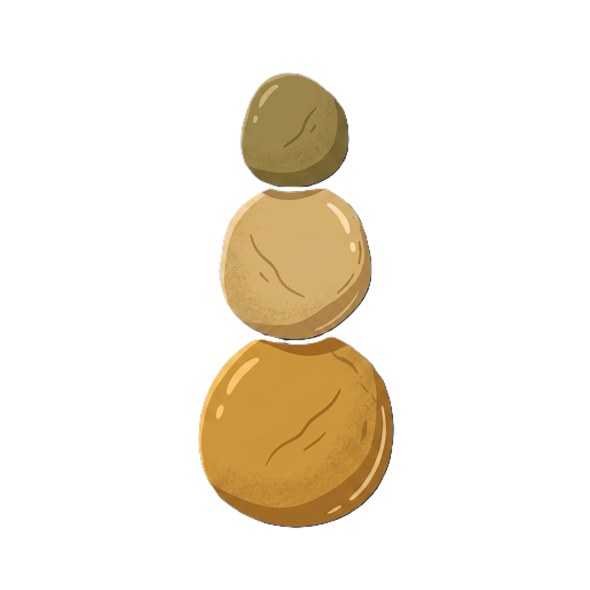

<p align="center">
  
</p>

<p align="center">
  <em>Cairn is an opinionated, local-first notes and GTD app for people who take thinking seriously.</em>
</p>

---

## About

Cairn is a desktop application for capturing, organizing, and acting on your thoughts. It borrows Obsidian's markdown-first discipline and David Allen's *Getting Things Done* methodology, and applies them to a single promise: your knowledge stays yours.

Every note is a plain `.md` file in a folder you chose. A small `.cairn/` directory inside each vault holds config, state, the reminder index, and soft-deleted notes — everything else is your markdown, readable by any editor, backup-friendly, and future-proof.

There is no cloud, no sync, no telemetry, no account.

### Features

- **Captures** — a drop-anything inbox for quick thoughts, memos, and pastes
- **Projects + Actions** — a project folder holds knowledge notes in its root and GTD action items under `Actions/`; the Home dashboard groups open actions, lets you drag to reorder, and completes with an optional reflection note that archives alongside the file
- **Someday** — parked ideas with preset reminders (tomorrow, in a week, in a month…) that fire via OS notifications and in-app toasts
- **Live-preview editor** — CodeMirror 6 renders headings, bold, italic, and inline code as you type; markers hide when the cursor is elsewhere on the line, keeping the markdown source untouched
- **Image paste** — pasting an image into a note writes it to the nearest `assets/` dir and inserts a relative link
- **Tags** — apply via frontmatter or the metadata bar; rename or recolor across the whole vault in one action, with unknown frontmatter keys preserved verbatim
- **Command palette** — `Ctrl/Cmd + K` for navigation and full-text search across the vault
- **Trash with restore** — soft-delete into `.cairn/trash/` with a mirrored path; one click to restore, collision-rename if needed, or Empty Trash to permanently remove
- **Multi-vault** — register several vaults and switch from the sidebar
- **File-watcher-aware** — edits made by external tools (another editor, `git pull`) are picked up and reflected in the UI within a debounce window

### Design principles

- **Local-first.** Nothing leaves your machine.
- **Plain markdown.** Your files are readable by any editor. Cairn is a lens on them, not a container.
- **Unknown frontmatter is sacred.** Hand-written YAML keys survive every round-trip — Cairn only touches fields it understands.
- **Calm focus.** Dark-first, restrained visual language inspired by Linear and Arc; one accent color (`#fac775`) used sparingly.

### Tech stack

- **Backend:** Rust, [Tauri 2](https://tauri.app/)
- **Frontend:** React 18, TypeScript, Vite, Tailwind CSS, [CodeMirror 6](https://codemirror.net/), [cmdk](https://cmdk.paco.me/), [dnd-kit](https://dndkit.com/)
- **Storage:** plain `.md` files + a small `.cairn/` config directory per vault

Deeper references: [`docs/ARCHITECTURE.md`](docs/ARCHITECTURE.md) for module map and IPC contract, [`docs/DESIGN.md`](docs/DESIGN.md) for tokens and component rules, [`CLAUDE.md`](CLAUDE.md) for coding conventions.

## Prerequisites

- **Rust** 1.77 or newer — [install](https://www.rust-lang.org/tools/install)
- **Node.js** 20 or newer
- **pnpm** 10 or newer — `npm install -g pnpm`
- **Windows:** [WebView2 runtime](https://developer.microsoft.com/en-us/microsoft-edge/webview2/) (bundled with Windows 11)
- **macOS:** Xcode Command Line Tools — `xcode-select --install`
- **Linux:** `webkit2gtk-4.1`, `libssl-dev`, `libgtk-3-dev`, `libayatana-appindicator3-dev`, `librsvg2-dev`

## Install

```bash
git clone https://github.com/amerkld/Cairn.git
cd Cairn
pnpm install
```

The first build compiles the full Tauri + Rust toolchain and takes a few minutes; subsequent builds are fast.

## Run

```bash
# Hot-reload dev: Vite for the frontend, cargo watch for the Rust side
pnpm tauri:dev
```

On first launch, Cairn prompts you to pick a folder to use as your vault. Any folder works — Cairn writes a `.cairn/` subdirectory into it and leaves the rest for you.

```bash
# Production build — produces an installer under src-tauri/target/release/bundle
pnpm tauri:build
```

## Development

Frontend:

```bash
pnpm typecheck    # tsc --noEmit
pnpm test         # vitest
pnpm lint         # eslint
pnpm build        # vite production bundle
```

Backend:

```bash
cd src-tauri
cargo test
cargo clippy
```

The full test suite currently runs 107 Rust tests and 80 frontend tests. See [`CLAUDE.md`](CLAUDE.md) for the testing discipline and code-quality rules.

## Keyboard shortcuts

| Keys | Action |
|---|---|
| `Ctrl/Cmd + K` | Open the command palette |
| `Ctrl/Cmd + N` | New capture |
| `?` | Show the keyboard shortcuts sheet |

## Status

Phase 1 is complete — daily-driver scope. The Miro-style freeform Captures canvas, AI integration (per [Karpathy's gist](https://gist.github.com/karpathy/442a6bf555914893e9891c11519de94f)), sync, and plugins are Phase 2+.
