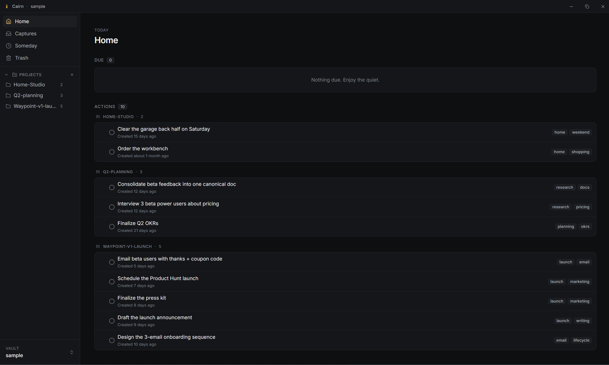
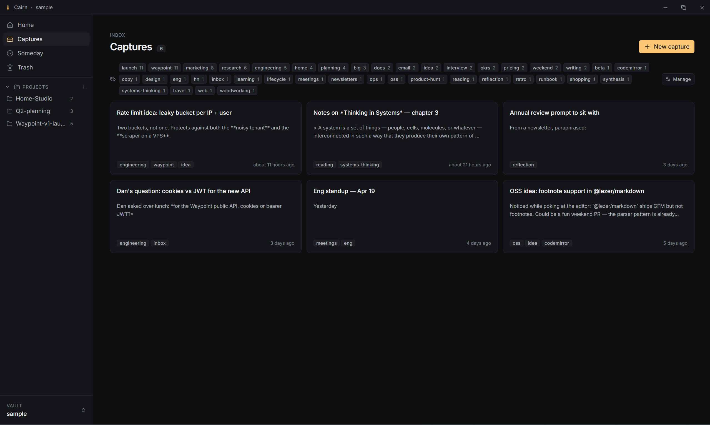
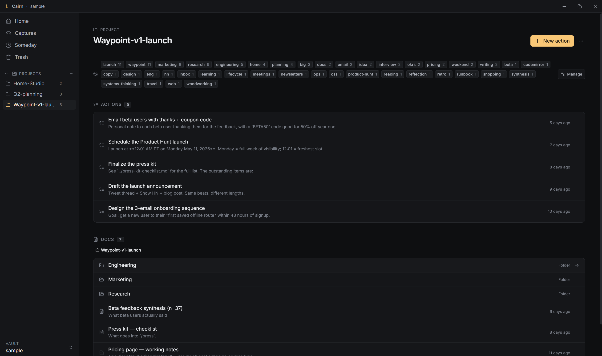
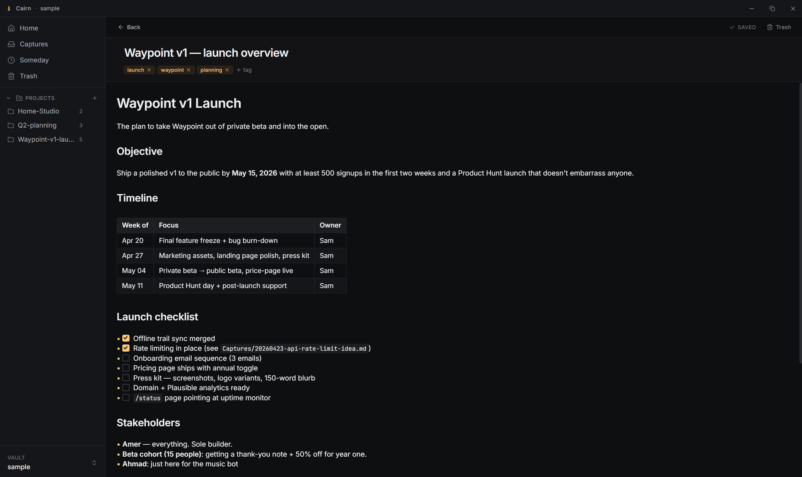

<p align="center">
  
</p>

<p align="center">
  <em>A local-first notes and GTD app for people who take thinking seriously.</em>
</p>

---

> I built Cairn to cover a gap I had with my Obsidian setup that I just couldn't achieve with plugins no matter how hard I tried. I wanted a neat way to capture my thoughts on the fly while working, go through > and expand on them in a simple way, and finally organize my knowledge across all projects in an LLM-friendly way. Earlier this year, I picked up a copy of David Allen's Getting Things Done and took a few > principles and put a twist on them in a way that works for me. This new structure dramatically increased my productivity towards the latter half of 2025, and Cairn implements that system natively. I already > use it daily, and if it helps one person get a step closer to their goals then it'll have fulfilled its purpose.

## Watch it in action

The quick-capture flow. A global shortcut, a floating dialog, a note on disk.

<div align="center">
  <div>
    <a href="https://www.loom.com/share/764378b747914153a76edf5e057592bf">
      
    </a>
  </div>
</div>

## What Cairn is

Cairn is a desktop application for capturing, organizing, and acting on your thoughts. It borrows Obsidian's markdown-first discipline and David Allen's *Getting Things Done* methodology, and applies them to a single promise: your knowledge stays yours.

Every note is a plain `.md` file in a folder you chose. A small `.cairn/` directory inside each vault holds config, state, the reminder index, and soft-deleted notes. Everything else is your markdown, readable by any editor, backup-friendly, and future-proof.

There is no cloud, no sync, no telemetry, no account.

## A quick tour

### Home

Your day at a glance. Open actions across every project, sorted however you dragged them. Reminders firing today. Recent activity so you can pick up where you left off.

<p align="center">
  
</p>

### Captures

The inbox. Quick thoughts, meeting notes, half-baked ideas. Process later, move into a project when the shape is clear, or send to Someday if it's not ready.

<p align="center">
  
</p>

### Projects

A project is a folder. Loose notes live at the root, GTD action items live under `Actions/`, and you can nest subfolders as deep as you want. The breadcrumb follows you.

<p align="center">
  
</p>

### The editor

CodeMirror 6 with a full live-preview pipeline. Full GitHub Flavored Markdown: tables render as real HTML, task-list checkboxes click, images load inline, `~~strikethrough~~` does what it says. Syntax markers hide when the cursor isn't on them, so the markdown source stays clean.

<p align="center">
  
</p>

## Features at a glance

- **Captures.** A drop-anything inbox for quick thoughts, memos, and pastes.
- **Projects and Actions.** Project folders for knowledge, `Actions/` folders for GTD work. Completed actions archive alongside the file with an optional reflection note.
- **Someday.** Parked ideas with preset reminders (tomorrow, in a week, in a month) that fire via OS notifications and in-app toasts.
- **Live-preview editor.** Headings, bold, italic, inline code, strikethrough, links, images, task lists, and GFM tables all render as you type. The markdown source stays untouched.
- **Image paste.** Drop an image into a note, Cairn writes it to the nearest `assets/` dir and inserts a relative link.
- **Tags.** Apply via frontmatter or the metadata bar. Rename or recolor across the whole vault in one action. Unknown frontmatter keys are preserved verbatim.
- **Command palette.** `Ctrl/Cmd + K` for navigation and full-text search across the vault.
- **Quick Capture.** A system-wide keyboard shortcut opens a small floating window for capturing without leaving whatever you were doing.
- **Trash with restore.** Soft-delete into `.cairn/trash/` with a mirrored path. One click to restore, with collision-rename if needed. Empty Trash permanently removes.
- **Multi-vault.** Register several vaults and switch from the sidebar.
- **File-watcher-aware.** Edits made by external tools (another editor, `git pull`) surface in the UI within a debounce window.

## Design principles

- **Local-first.** Nothing leaves your machine.
- **Plain markdown.** Your files are readable by any editor. Cairn is a lens on them, not a container.
- **Unknown frontmatter is sacred.** Hand-written YAML keys survive every round-trip. Cairn only touches fields it understands.
- **Calm focus.** Dark-first, restrained visual language inspired by Linear and Arc. One accent color (`#fac775`), used sparingly.

## Tech stack

- **Backend:** Rust, [Tauri 2](https://tauri.app/)
- **Frontend:** React 18, TypeScript, Vite, Tailwind CSS, [CodeMirror 6](https://codemirror.net/), [cmdk](https://cmdk.paco.me/), [dnd-kit](https://dndkit.com/)
- **Storage:** plain `.md` files plus a small `.cairn/` config directory per vault

Deeper references: [`docs/ARCHITECTURE.md`](docs/ARCHITECTURE.md) for the module map and IPC contract, [`docs/EDITOR.md`](docs/EDITOR.md) for the live-preview editor, [`docs/DESIGN.md`](docs/DESIGN.md) for tokens and component rules, [`CLAUDE.md`](CLAUDE.md) for coding conventions.

## Prerequisites

- **Rust** 1.77 or newer ([install](https://www.rust-lang.org/tools/install))
- **Node.js** 20 or newer
- **pnpm** 10 or newer (`npm install -g pnpm`)
- **Windows:** [WebView2 runtime](https://developer.microsoft.com/en-us/microsoft-edge/webview2/) (bundled with Windows 11)
- **macOS:** Xcode Command Line Tools (`xcode-select --install`)
- **Linux:** `webkit2gtk-4.1`, `libssl-dev`, `libgtk-3-dev`, `libayatana-appindicator3-dev`, `librsvg2-dev`

## Install

```bash
git clone https://github.com/amerkld/cairn.git
cd cairn
pnpm install
```

The first build compiles the full Tauri and Rust toolchain and takes a few minutes. Subsequent builds are fast.

## Run

```bash
# Hot-reload dev: Vite for the frontend, cargo watch for the Rust side.
pnpm tauri:dev
```

On first launch, Cairn prompts you to pick a folder to use as your vault. Any folder works. Cairn writes a `.cairn/` subdirectory into it and leaves the rest for you.

```bash
# Production build. Produces installers (NSIS + MSI on Windows) under
# src-tauri/target/release/bundle.
pnpm tauri:build
```

A ready-made dev / demo vault lives at [`sample/`](sample/) if you want something to point Cairn at right after installing.

## Development

Frontend:

```bash
pnpm typecheck
pnpm test
pnpm lint
pnpm build
```

Backend:

```bash
cd src-tauri
cargo test
cargo clippy
```

See [`CLAUDE.md`](CLAUDE.md) for the testing discipline and code-quality rules.

## Keyboard shortcuts

| Keys | Action |
|---|---|
| `Ctrl/Cmd + K` | Open the command palette |
| `Ctrl/Cmd + N` | New capture |
| `Ctrl/Cmd + Shift + N` | Open Quick Capture (global, even when Cairn isn't focused) |
| `?` | Show the keyboard shortcuts sheet |

## Roadmap

The daily-driver scope is shipping. What's next, roughly ordered:

- **File sync.** Optional, end-to-end-encrypted sync so a vault can live on more than one machine without giving up local-first. The source of truth stays on disk. Sync is additive, never required.
- **Local and BYOK LLM integration.** A writing and thinking assistant that can read your vault with your permission. Runs either against a local model (Ollama, LM Studio, llama.cpp) or a provider you've supplied a key for (Anthropic, OpenAI, Google). No data leaves the machine unless you deliberately choose a cloud model.
- **Plugins.** A typed extension API for third-party views, commands, and editor decorations. The core stays small. The ecosystem can stretch.
- **Mobile**<sup>\*</sup>**.** A read-and-capture companion app for iOS and Android, sharing a vault with the desktop over the sync layer above.

<sub><sup>\*</sup> Long term. Revisit once the sync and plugin foundations are stable.</sub>
